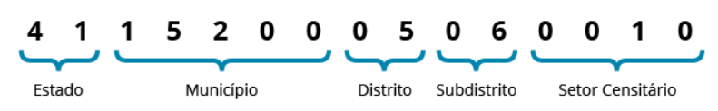

```{r setup, include=FALSE}
knitr::opts_chunk$set(echo = TRUE)
```

O objetivo deste Laboratório é identificar o nível geográfico mais específico considerado no Censo Demográfico e explorar as oportunidades analíticas relacionadas aos dados, especialmente em relação às questões do questionário abordando a população em geral. Inicialmente, o enfoque será direcionado a alguns indicadores demográficos, bem como às limitações inerentes ao cálculo dessas estatísticas em um nível altamente detalhado. As segmentações geográficas começarão por setores censitários e poderão se estender até a consolidação em nível municipal.

# Contextualização

## Censo Demográfico
O Censo Demográfico representa a operação estatística mais complexa conduzida por uma nação, pois abrange a análise das características de toda a população e dos domicílios de todo o território nacional.

Os Censos Demográficos desempenham o papel singular de investigar todos od domicílios do país, constituindo a fonte primordial para compreender as situações vivenciadas pela população em todos os municípios, incluindo divisões internas como distritos, subdistritos, bairros, bem como a classificação baseada na localização das habitações, seja em ambientes urbanos ou rurais.

Os registros desse conjunto de dados, organizados por setor censitário, englobam atributos das residências particulares e das pessoas pesquisadas para a totalidade da população, sendo convencionalmente denominados resultados do universo. Essas informações foram obtidas ao reunir os detalhes por meio da análise das características dos domicílios e das pessoas. Esses aspectos são comuns aos dois tipos de questionários aplicados no censo demográfico de 2010, os quais serviram como base para a coleta desses dados: o questionário básico (universo) e o questionário da amostra.


## Setores censitários

O setor censitário constitui a menor unidade territorial, delimitada por uma área contígua que está completamente inserida em zonas urbanas ou rurais. Sua extensão é ajustada para facilitar a execução de pesquisas, e a coleção de todos esses setores abrange a totalidade do território nacional, garantindo, assim, a abrangência integral de todo o país.

Cada setor censitário é distinguido por um número identificador, conhecido como geocódigo. Esse geocódigo é construído por meio da reunião da estrutura da hierarquia político-administrativa à qual o setor censitário pertence: os dois primeiros dígitos correspondem ao código do estado; os cinco subsequentes estão relacionados ao município; os dois seguintes indicam o distrito; os dois na sequência apontam o subdistrito; e, por último, os quatro dígitos finais identificam o setor censitário. Para mais informações detalhadas sobre a Malha de Setores Censitários, consulte. ver [aqui](https://www.ibge.gov.br/geociencias/organizacao-do-territorio/malhas-territoriais/26565-malhas-de-setores-censitarios-divisoes-intramunicipais.html?=&t=saiba-mais-edicao)



## Identificando setores

Escolha um setor em: https://censo2010.ibge.gov.br/painel/ e salve o número do setor escolhido no objetivo `setor_escolhido`:

```{r setor, echo=TRUE}
setor_escolhido <- 310620005680043
```

Quais dados estão disponíveis para os setores censitários? 

Primeiro, é necessário conhecer a documentação disponível [aqui](https://ftp.ibge.gov.br/Censos/Censo_Demografico_2010/Resultados_do_Universo/Agregados_por_Setores_Censitarios/). Depois disso, o passo seguinte é importar os dados.

# Base de dados

A base de dados de agregados por setores do IBGE é uma fonte robusta e abrangente de informações socioeconômicas e demográficas que oferece um panorama detalhado das características das áreas geográficas em seu menor nível territorial. A granularidade dessas informações tornam a base de dados de agregados por setores do IBGE uma ferramenta crucial para a formulação de políticas, estudos acadêmicos e análises de mercado.

## Download dos dados 

Importando os dados dos arquivos *Básico* e *Domicílio02* por existir o interesse em variáveis disponíveis nessas duas bases de dados. Em sequência organiza-se em um único dataframe *df*.

```{r download, echo=TRUE}
library(readxl)
library(tidyverse)
df.basico <- read_excel("C:/Users/Caio/Desktop/Basico-MG.xls") %>% select("Cod_setor","Cod_municipio","Nome_do_municipio","Cod_bairro","Nome_do_bairro","Cod_subdistrito","Nome_do_subdistrito")
df.pessoa <- read_excel("C:/Users/Caio/Desktop/Domicilio02_MG.xls")

df <- merge(df.basico,df.pessoa)
rm(df.pessoa,df.basico)
```
## Verificando variáveis

O pacote [DataMaid](https://cran.r-project.org/web/packages/dataMaid/index.html) é uma ferramenta valiosa no ambiente R para a verificação, limpeza e organização eficiente de conjuntos de dados. Desenvolvido com o objetivo de aprimorar a qualidade e confiabilidade dos dados, o DataMaid oferece funcionalidades que auxiliam na identificação de valores ausentes, erros de digitação, inconsistências e outras anomalias nos dados. Além disso, permite a criação de relatórios detalhados, facilitando a compreensão das estruturas e conteúdo dos datasets, promovendo assim uma exploração mais assertiva. Com suas capacidades automatizadas de geração de sumários e gráficos descritivos, o DataMaid é uma ferramenta valiosa para cientistas de dados e analistas que desejam garantir a qualidade e integridade dos seus dados, tornando todo o processo de análise mais eficiente e confiável.

```{r verificação, echo=TRUE}
library(dataMaid)
# makeDataReport(df,replace = TRUE)
```

O que foi possível verificar com o relatório produzido anteriormente? Anote para implementar na sequÊncia, porém, em conjunto com essas mudanças, planeje os indicadores a serem calculados e identifique as mudanças necessárias para tal.

## Modificando variáveis

Pensando em cada uma as variáveis. Faça uma lista do é possível calcular dos indicadores demográficos apresentados.Por exemplo:

1. Total populacional
2. Total populacional e a proporção por situação de domicílio
3. Taxa de urbanização
4. Total populacional e a proporção por sexo
5. Total populacional e a proporção por sexo e idade (base para a pirâmide etária)
...

A partir dos indicadores que se planeja calcular, realize as modificações na base necessárias para isso:

```{r variaveis, echo=TRUE}
library(tidyselect)
df <- df %>% mutate(
  Cod_setor= as.character(Cod_setor),
  Situacao_setor_agreg = case_when(Situacao_setor==1 | Situacao_setor==2 |
                                     Situacao_setor==3   ~ "Urbano",
                                     Situacao_setor==4 | Situacao_setor==5 |
                                     Situacao_setor==6 | Situacao_setor==7 |
                                     Situacao_setor==8 ~ "Rural")
)

```

# Análise dos dados

## Tamanho
total de população

```{r tamanho, echo=TRUE}
library(knitr)
library(kableExtra)

tab01 <- df %>% summarise(
  pop = sum(V001)
)
tab01 %>%
  kbl() %>%
  kable_minimal()

tab02<- df %>% group_by(Nome_do_municipio) %>% summarise(
  pop = sum(V001)
)
tab02 %>%
  kbl() %>%
  kable_minimal()

df %>%filter(Nome_do_municipio == "BELO HORIZONTE") %>% group_by(Nome_do_subdistrito) %>% summarise(
  pop = sum(V001)
)

df %>%filter(Nome_do_municipio == "BELO HORIZONTE") %>% group_by(Nome_do_bairro) %>% summarise(
  pop = sum(V001)
)
```

## Distribuição
proporação da população
Situação_setor
taxa de urbanização

```{r distribuição, echo=TRUE}
df %>% summarise(
  pop = sum(V001)
)

df %>% group_by(Situacao_setor_agreg) %>% summarise(
  pop = sum(V001)
)


df %>% group_by(Nome_do_municipio) %>% summarise(
  pop = sum(V001)
)

df %>%filter(Nome_do_municipio == "BELO HORIZONTE") %>% group_by(Nome_do_subdistrito) %>% summarise(
  pop = sum(V001)
)

df %>%filter(Nome_do_municipio == "BELO HORIZONTE") %>% group_by(Nome_do_bairro) %>% summarise(
  pop = sum(V001)
)

```
## estrutura etária
pirâmide etária
razão de sexo
indice de envelhecimento
razão de dependência
