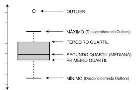

```{r setup, include=FALSE}
knitr::opts_chunk$set(echo = TRUE)
```

O objetivo deste tutorial é explorar os dados do produto interno bruto
dos municípios com apresentações em mapas, bem como revisar regressão
linear.

# Contextualização

## Produto Interno Bruto (PIB)

PIB representa o total dos bens e serviços produzidos pelas unidades
produtoras residentes destinados aos usos finais, sendo, portanto,
equivalente à soma dos valores adicionados pelas diversas atividades
econômicas acrescida dos impostos, líquidos de subsídios, sobre produtos
(PIB pela ótica da produção).

# Base de dados

## Leitura dos dados

Defina o diretório para o local onde está a base de dados e importe a
bse completa:

```{r dados, echo=TRUE, warning=FALSE}
options(scipen = 999) # opção para não exibir números científicos
library(readxl)
pib_mun <- read_excel("PIB dos Municípios - base de dados 2010-2020.xls")
```

Ao visulizar a estrutura dos dados, o nomes das colunas não está na
melhor forma para manipulação. Assim, é recomendado algumas alterações:

```{r dados2, warning=FALSE, include=FALSE}
str(pib_mun)
colnames(pib_mun) <- c("ano","cod_gr","nome_gr",
                            "cod_uf", "sigla_uf","nome_uf",
                            "code_muni","nome_mun",
                            "rm",
                       "cod_meso","nome_meso",
                       "cod_micro","nome_micro",
                       "cod_regim","nome_regim","mun_regim",
                       "cod_regint","nome_regint","mun_regit",
                       "cod_conc","nome_conc","tipo_conc",
                       "cod_arranjo","nome_arranjo",
                       "hier_urb","hier_urb_prin",
                       "cod_regiao_rural","nome_regiao_rural","regiao_rural_nucleo","amaz_legal","semiarido","cidade_regiao_sp",
                       "va_agro","va_ind","va_serv","va_admin","va",
                       "imp","pib","pib_pc",
                       "ativ_1","ativ_2","ativ_3"
                              )
```

## Verificando variáveis

O pacote
[DataMaid](https://cran.r-project.org/web/packages/dataMaid/index.html)
é uma ferramenta valiosa no ambiente R para a verificação, limpeza e
organização eficiente de conjuntos de dados. Desenvolvido com o objetivo
de aprimorar a qualidade e confiabilidade dos dados, o DataMaid oferece
funcionalidades que auxiliam na identificação de valores ausentes, erros
de digitação, inconsistências e outras anomalias nos dados. Além disso,
permite a criação de relatórios detalhados, facilitando a compreensão
das estruturas e conteúdo dos datasets, promovendo assim uma exploração
mais assertiva. Com suas capacidades automatizadas de geração de
sumários e gráficos descritivos, o DataMaid é uma ferramenta para
cientistas de dados e analistas que desejam garantir a qualidade e
integridade dos seus dados, tornando todo o processo de análise mais
eficiente e confiável.

```{r verificação, echo=TRUE, warning=FALSE}
library(dataMaid)
makeDataReport(pib_mun,replace = TRUE)
```

O que foi possível verificar com o relatório produzido anteriormente?

## Perguntas

O principal indicador, PIB e o valor adicionado por atividades já foi
calculado, assim vamos pensar na apresentação e análise desses dados
tentando responder as seguintes perguntas?

1.  Quais os dez municípios que mais ganharam participação no PIB entre
    os anos de 2010 e 2019? E os dez que mais perderam?
2.  Quais os municípios que possuem a produção agropecuária como mais
    importante para sua economia local? E para a indústria e os
    Serviços? Quais possuem a Administração Pública como principal
    atividade?
3.  Qual a relação entre PIB percapita e Expectativa de Vida?

```{r manipulando, echo=TRUE}
library(tidyverse)
pib_mun_mg <- pib_mun %>%  filter(cod_uf == 31) %>% 
  mutate(p.agro = va_agro/va *100,
         p.ind = va_ind/va*100,
         p.serv = va_serv/va*100,
         p.admin = va_admin/va*100
  ) %>% group_by(ano) %>% mutate(p.pib = pib/sum(pib)*100)
```

# Participação no PIB

```{r partic, echo=TRUE}
library(tidyr)

# organiza base com os dados necessários e calcula a diferença
base1 <- pib_mun_mg %>%  select(ano,code_muni, nome_mun,p.pib) %>% spread(ano,p.pib) %>% mutate(dif_2019_2010 = round(`2019`-`2010`,2))

# organiza tabela com os dez municípios que mais ganharam participação
arrange(base1,desc(base1$dif_2019_2010))[1:10,c("code_muni","nome_mun","dif_2019_2010")]

# organiza tabela com os dez municípios que mais perderam participação
arrange(base1,base1$dif_2019_2010)[1:10,c("code_muni","nome_mun","dif_2019_2010")]

```

Fazendo um mapa dos que ganharam mais participação e aqueles que mais
perderam:

```{r mapa, message=FALSE, warning=FALSE}
library(geobr)  
mun <- read_municipality(code_muni = "MG", year = 2019,showProgress = FALSE)  

#Juntar coordenadas para criar o mapa 
base_mapa<- left_join(base1, mun , by = 'code_muni')
```

Agora, vamos plotar os resultados em um mapa estático e um interativo.

```{r variaveis, echo=TRUE, warning=FALSE}
# Carregar bibliotecas 
library(ggplot2) 
library(plotly)  
library(ggspatial)

# Criar o gráfico ggplot com o PIB 
ggplot_obj_1 <- base_mapa %>% 
  ggplot() +   
  geom_sf(data = base_mapa$geom, aes(fill = base_mapa$dif_2019_2010, 
                                     text = paste("Município: ", base_mapa$nome_mun, "<br>Diferença participação: ", base_mapa$dif_2019_2010, "%"))) +   
  scale_fill_viridis_c(option = 15, begin = 0.2, end = 0.8, name = 'Diferença part.') +
  annotation_scale(location = "bl", width_hint = 0.3) + 
  annotation_north_arrow(location = "bl", which_north = "true", 
        pad_x = unit(0.3, "in"), pad_y = unit(0.3, "in"),
        style = north_arrow_fancy_orienteering) +
  theme(panel.grid = element_line(colour = "transparent"),panel.background =  element_blank(),axis.text = element_blank(),axis.ticks = element_blank()) +   
  labs(title = "Diferença de participação do PIB dos Municípios de MG - 2019-2010 (%)", subtitle = "",caption = 'Fonte: IBGE. Elaboração própria', size = 8)  
ggplot_obj_1
```

Fazendo uma versão interativa:

```{r variaveis2, echo=TRUE, warning=FALSE}
# Converter o gráfico ggplot para plotly
interactive_plot_1 <- ggplotly(ggplot_obj_1, tooltip = "text")
# Exibir o gráfico interativo 
interactive_plot_1
```

# Atividades mais importantes

```{r imp, echo=TRUE, warning=FALSE}
library(tidyr)

# organiza base com os dados necessários e calcula a diferença
base2 <- pib_mun_mg %>%  select(ano,code_muni, nome_mun,p.agro,p.ind,p.serv,p.admin) %>% filter(ano==2020) 

# organiza tabela com os dez municípios em que agropecuária é mais importante
arrange(base2,desc(base2$p.agro))[1:10,c("code_muni","nome_mun","p.agro")]

# organiza tabela com os dez municípios em que a industria é mais importante
arrange(base2,desc(base2$p.ind))[1:10,c("code_muni","nome_mun","p.ind")]

# organiza tabela com os dez municípios em que os serviços é mais importante
arrange(base2,desc(base2$p.serv))[1:10,c("code_muni","nome_mun","p.serv")]

# organiza tabela com os dez municípios em que a administração pública é mais importante
arrange(base2,desc(base2$p.admin))[1:10,c("code_muni","nome_mun","p.admin")]
```

Representando em mapas:

```{r imp2, echo=TRUE, warning=FALSE}
#Juntar coordenadas para criar o mapa 
base_mapa2<- left_join(base2, mun , by = 'code_muni')

# Agropecuária
ggplot_obj_2 <- base_mapa2 %>% 
  ggplot() +   
  geom_sf(data = base_mapa2$geom, aes(fill = base_mapa2$p.agro, 
                                     text = paste("Município: ", base_mapa2$nome_mun, "<br>Part. Agropecuária: ", base_mapa2$p.agro, "%"))) +   
  scale_fill_viridis_c(option = 15, begin = 0.2, end = 0.8, name = 'Part. Agropecuária') +
  annotation_scale(location = "bl", width_hint = 0.3) + 
  annotation_north_arrow(location = "bl", which_north = "true", 
        pad_x = unit(0.3, "in"), pad_y = unit(0.3, "in"),
        style = north_arrow_fancy_orienteering) +
  theme(panel.grid = element_line(colour = "transparent"),panel.background =  element_blank(),axis.text = element_blank(),axis.ticks = element_blank()) +   
  labs(title = "Participação da Agropecuária no VA total municipal - 2020 (%)", subtitle = "",caption = 'Fonte: IBGE. Elaboração própria', size = 8)  
ggplot_obj_2

# Indústria
ggplot_obj_3 <- base_mapa2 %>% 
  ggplot() +   
  geom_sf(data = base_mapa2$geom, aes(fill = base_mapa2$p.ind, 
                                     text = paste("Município: ", base_mapa2$nome_mun, "<br>Part. Indústria: ", base_mapa2$p.ind, "%"))) +   
  scale_fill_viridis_c(option = 15, begin = 0.2, end = 0.8, name = 'Part. Indústria') +
  annotation_scale(location = "bl", width_hint = 0.3) + 
  annotation_north_arrow(location = "bl", which_north = "true", 
        pad_x = unit(0.3, "in"), pad_y = unit(0.3, "in"),
        style = north_arrow_fancy_orienteering) +
  theme(panel.grid = element_line(colour = "transparent"),panel.background =  element_blank(),axis.text = element_blank(),axis.ticks = element_blank()) +   
  labs(title = "Participação da Indústria no VA total municipal - 2020 (%)", subtitle = "",caption = 'Fonte: IBGE. Elaboração própria', size = 8)  
ggplot_obj_3

# Serviços
ggplot_obj_4 <- base_mapa2 %>% 
  ggplot() +   
  geom_sf(data = base_mapa2$geom, aes(fill = base_mapa2$p.serv, 
                                     text = paste("Município: ", base_mapa2$nome_mun, "<br>Part. Serviços: ", base_mapa2$p.serv, "%"))) +   
  scale_fill_viridis_c(option = 15, begin = 0.2, end = 0.8, name = 'Part. Serviços') +
  annotation_scale(location = "bl", width_hint = 0.3) + 
  annotation_north_arrow(location = "bl", which_north = "true", 
        pad_x = unit(0.3, "in"), pad_y = unit(0.3, "in"),
        style = north_arrow_fancy_orienteering) +
  theme(panel.grid = element_line(colour = "transparent"),panel.background =  element_blank(),axis.text = element_blank(),axis.ticks = element_blank()) +   
  labs(title = "Participação dos Serviços no VA total municipal - 2020 (%)", subtitle = "",caption = 'Fonte: IBGE. Elaboração própria', size = 8)  
ggplot_obj_4

# Admnistração Pública
ggplot_obj_5 <- base_mapa2 %>% 
  ggplot() +   
  geom_sf(data = base_mapa2$geom, aes(fill = base_mapa2$p.admin, 
                                     text = paste("Município: ", base_mapa2$nome_mun, "<br>Part. Adm. Pública: ", base_mapa2$p.admin, "%"))) +   
  scale_fill_viridis_c(option = 15, begin = 0.2, end = 0.8, name = 'Part. Adm. Publica') +
  annotation_scale(location = "bl", width_hint = 0.3) + 
  annotation_north_arrow(location = "bl", which_north = "true", 
        pad_x = unit(0.3, "in"), pad_y = unit(0.3, "in"),
        style = north_arrow_fancy_orienteering) +
  theme(panel.grid = element_line(colour = "transparent"),panel.background =  element_blank(),axis.text = element_blank(),axis.ticks = element_blank()) +   
  labs(title = "Participação da Admin. Pública no VA total municipal- 2020 (%)", subtitle = "",caption = 'Fonte: IBGE. Elaboração própria', size = 8)  
ggplot_obj_5
```

# PIB per capita x Expectativa de Vida

Vamos investigar se existe uma relação linear entre PIB per capita e
expectativa de vida ao nascer, ou seja, os municípios com os maiores PIB
percapita são aqueles onde as expectativas de vida ao nascer é maior?

## Montando a base de dados

```{r exp, echo=TRUE, warning=FALSE}
library(tidyr)

# organiza base com os dados necessários e calcula a diferença
base3 <- pib_mun_mg %>%  select(ano,code_muni, nome_mun,pib_pc) %>% filter(ano==2010) 

# organiza tabela com os dez municípios com maiores PIB percapita e aqueles os 10 menores
arrange(base3,desc(base3$pib_pc))[1:10,c("code_muni","nome_mun","pib_pc")]
arrange(base3,base3$pib_pc)[1:10,c("code_muni","nome_mun","pib_pc")]

esperanca <- read_excel("esperanca_vida_nascer_mg.xlsx", 
     col_types = c("numeric", "text", "numeric"))
colnames(esperanca) <- c("code_muni","Município","e0")

# organiza tabela com os dez municípios com maiores expectativas de vida e aqueles os 10 menores
arrange(esperanca,desc(esperanca$e0))[1:10,c("code_muni", "Município","e0")]
arrange(esperanca,esperanca$e0)[1:10,c("code_muni", "Município","e0")]
base3 <- merge(base3,esperanca)

```

## Análise descritiva

```{r exp2, echo=TRUE, warning=FALSE}
# Esperança de vida ao nascer
summary(base3$e0)
hist(base3$e0)
boxplot(base3$e0)

# Relembrando
# 

# PIB per capita
summary(base3$pib_pc)
hist(base3$pib_pc)
boxplot(base3$pib_pc)

# Transformação logarítmica do PIB per capita
summary(log(base3$pib_pc))
hist(log(base3$pib_pc))
boxplot(log(base3$pib_pc))

# Gráfico de dispersão
ggplot(base3, aes(x=log(pib_pc), y=e0)) +
    geom_point()

# Correlação linear entre as variáveis
cor(log(base3$pib_pc),base3$e0)

# Teste de correlação
cor.test(log(base3$pib_pc),base3$e0)

```

## Regressão linear

Uma regressão linear é uma técnica estatística que é usada para modelar
a relação entre uma variável dependente (ou resposta) e uma ou mais
variáveis independentes (ou preditoras) através de uma equação linear. O
objetivo principal da regressão linear é entender e prever como as
mudanças nas variáveis independentes afetam a variável dependente.

Aqui estão os principais elementos de uma regressão linear:

1.  **Variável Dependente (Y)**: A variável que estamos tentando prever
    ou explicar é chamada de variável dependente. É representada como
    "Y" na equação de regressão.

2.  **Variáveis Independentes (X)**: São as variáveis que usamos para
    prever a variável dependente. Podemos ter uma ou várias variáveis
    independentes, representadas como "X1", "X2", ..., "Xn" na equação.

3.  **Equação de Regressão**: A equação de regressão linear é uma
    expressão matemática que descreve como as variáveis independentes
    estão relacionadas à variável dependente. Em sua forma mais simples,
    a equação de regressão linear é:

    $$Y = \beta_0 + \beta_1X_1 + \beta_2X_2 + \ldots + \beta_nX_n + \epsilon$$

    -   $Y$ é a variável dependente.
    -   $\beta_0$ é o intercepto, que representa o valor esperado de $Y$
        quando todas as variáveis independentes são iguais a zero.
    -   $\beta_1, \beta_2, \ldots, \beta_n$ são os coeficientes de
        regressão, que representam como uma mudança em cada variável
        independente afeta $Y$.
    -   $\epsilon$ é o termo de erro, que representa a variação não
        explicada pelo modelo.

4.  **Objetivo da Regressão**: O objetivo principal da regressão linear
    é estimar os valores dos coeficientes ($\beta$) de forma que a
    equação de regressão se ajuste melhor aos dados observados. Isso é
    feito minimizando a soma dos quadrados dos resíduos (diferença entre
    os valores observados e os valores previstos pelo modelo).

5.  **Avaliação do Modelo**: A qualidade do ajuste do modelo é avaliada
    usando várias estatísticas, como o coeficiente de determinação
    ($R^2$), que mede a proporção da variação na variável dependente
    explicada pelas variáveis independentes.

6.  **Teste de Hipóteses**: Testes de hipóteses são usados para
    determinar se os coeficientes de regressão são estatisticamente
    significativos. Os testes t ou F são comuns para avaliar a
    significância dos coeficientes e a adequação global do modelo.

7.  **Previsão**: Uma vez que o modelo é ajustado e avaliado, ele pode
    ser usado para fazer previsões. Você pode inserir valores para as
    variáveis independentes na equação de regressão para prever o valor
    da variável dependente.

A regressão linear é uma ferramenta poderosa para analisar dados e
entender as relações entre variáveis. Ela é amplamente utilizada em
diversas áreas, como economia, ciências sociais, engenharia e ciências
naturais, para fazer previsões e tomar decisões com base em dados
observados. Existem várias extensões da regressão linear, como a
regressão linear múltipla, que envolve várias variáveis independentes, e
a regressão linear ponderada, que lida com dados ponderados.

```{r regressao, echo=TRUE, warning=FALSE}
# Regressão linear
model1 <- lm(e0 ~ log(pib_pc), data = base3)
summary(model1)
```

Para calcular o coeficiente de determinação (R²) em um modelo de
regressão linear no R, você pode usar a função **`summary()`** após
ajustar o modelo usando a função **`lm()`**. O R² é uma medida que
indica a proporção da variabilidade na variável de resposta que é
explicada pelo modelo.

O teste individual dos parâmetros, também conhecido como teste de
hipótese para coeficientes individuais, é uma parte fundamental da
análise de regressão. Esse teste é usado para determinar se cada
coeficiente estimado no modelo de regressão é estatisticamente
significativo, ou seja, se ele contribui de forma significativa para
explicar a variação na variável dependente. Vou explicar os passos
envolvidos em um teste individual dos parâmetros:

1.  **Formulação das Hipóteses**:
    -   **Hipótese Nula (H0)**: A hipótese nula assume que o coeficiente
        do parâmetro é igual a zero, o que significa que a variável
        independente correspondente não tem efeito sobre a variável
        dependente.
    -   **Hipótese Alternativa (Ha)**: A hipótese alternativa afirma que
        o coeficiente do parâmetro é diferente de zero, o que significa
        que a variável independente tem um efeito significativo sobre a
        variável dependente.
2.  **Cálculo da Estatística de Teste**:
    -   A estatística de teste depende do tipo de teste de hipótese
        usado. Em uma regressão linear comum, o teste t é frequentemente
        usado. A estatística de teste t para um coeficiente específico é
        calculada da seguinte forma:

        $$
        t = \frac{\text{Estimativa do Coeficiente}}{\text{Erro Padrão do Coeficiente}}
        $$
3.  **Determinação do Grau de Liberdade**:
    -   O grau de liberdade do teste t é igual ao número de observações
        menos o número de parâmetros estimados no modelo.
4.  **Cálculo do Valor-p**:
    -   Usando a estatística de teste t e o grau de liberdade, é
        possível calcular o valor-p associado ao coeficiente do
        parâmetro. O valor-p é a probabilidade de observar um valor tão
        extremo quanto o valor observado da estatística de teste t,
        assumindo que a hipótese nula seja verdadeira.
5.  **Tomada de Decisão**:
    -   Com base no valor-p calculado, você toma uma decisão
        estatística. Se o valor-p for menor que um nível de
        significância pré-determinado (geralmente 0,05), você rejeita a
        hipótese nula e conclui que o coeficiente do parâmetro é
        estatisticamente significativo. Caso contrário, se o valor-p for
        maior que o nível de significância, você não rejeita a hipótese
        nula e conclui que o coeficiente do parâmetro não é
        estatisticamente significativo.
6.  **Interpretação dos Resultados**:
    -   Se você rejeitar a hipótese nula, isso significa que a variável
        independente correspondente tem um efeito estatisticamente
        significativo sobre a variável dependente. Se você não rejeitar
        a hipótese nula, isso sugere que a variável independente não tem
        um efeito estatisticamente significativo.

O teste individual dos parâmetros é útil para identificar quais
variáveis independentes são importantes para o modelo e merecem ser
mantidas na análise. Isso ajuda a simplificar o modelo, removendo
variáveis que não contribuem significativamente para explicar a variação
na variável dependente. No entanto, lembre-se de que a interpretação dos
resultados também deve levar em consideração o contexto do problema e a
teoria subjacente.

```{r regressao2, echo=TRUE, warning=FALSE}
# Regressão múltipla
base3$log_pib_pc_2 <- log(base3$pib_pc)^2

model2 <- lm(e0 ~ log(pib_pc) + log_pib_pc_2, data = base3)
summary(model2)
```
